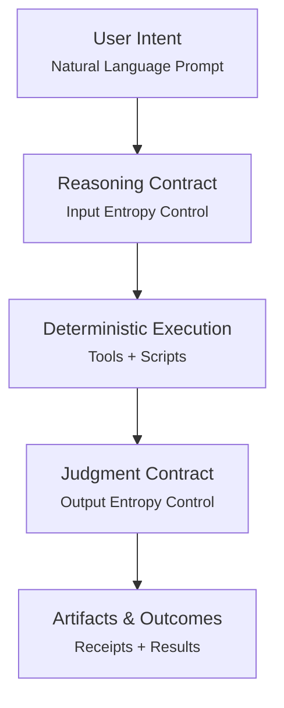

# ASI (Agent Skill Interface)

**ASI** is a behavioral governance specification that proposes a concrete, repeatable approach to building auditable, deterministic, and productive agent skills.

This repository contains a publication-grade, agent-followable specification that defines **when reasoning is allowed**, **how scope is constructed**, **what may mutate**, and **how failure must surface**.

---

## Two Paths

> *"Do you want me to explain, or do you want to have some fun?"*

### 🎮 Just Use It

Skip the theory. Invoke the skills directly:

```text
/asi-kickoff   → Design a new skill (produces KICKOFF.md)
/asi-plan      → Plan the work (produces PLAN.md + TODO.md)  
/asi-exec      → Execute with receipts (produces RECEIPT.md)
```

Or point your agent at the spec:

```text
Fetch https://raw.githubusercontent.com/JordanGunn/asi/refs/heads/master/llms.txt
```

### 📖 Understand It

Read the [Manifesto](docs/manifesto/.INDEX.md) to understand *why* ASI exists, then the [Design Documentation](docs/design/.INDEX.md) for *how* it works.

---

## Overview

ASI addresses a fundamental problem: agents are powerful but unpredictable. Without governance, they reason over unbounded surfaces, make silent decisions, and produce results that cannot be audited or reproduced.

ASI solves this by enforcing a structured execution flow where **determinism precedes reasoning** and **all discretion is contracted**:



| Layer | Purpose |
|-------|---------|
| **User Intent** | Natural language prompt—high entropy, incomplete, ambiguous |
| **Reasoning Contract** | Bounds interpretation; reduces input to a form deterministic mechanisms can consume |
| **Deterministic Execution** | Mechanical truth-making—reproducible, auditable, scriptable |
| **Judgment Contract** | Constrains output discretion; governs selection, framing, recommendations |
| **Artifacts & Outcomes** | Durable records (receipts, indexes) and user-facing results |

## What ASI Defines

- **Deterministic surface reduction** before reasoning begins
- **Skills** as the policy-gated entry point to capability
- **Reasoning and judgment contracts** that bound agent discretion
- **Strict passive behavior** (observe/report; no silent action)
- **Auditable state changes** and explicit failure semantics

## What ASI is Not

ASI is **not**:

- a protocol or transport
- a framework or SDK requirement
- "smart tools" that auto-run in the background

## Skills

This repository includes reference skills that help design, plan, and implement skills using the principles defined in ASI.

See [docs/SKILLS.md](docs/SKILLS.md) for the skill design pipeline.

---

## Recommended reading path

This table of contents is a suggested order for first-time readers.

1. `docs/manifesto/.INDEX.md` — Narrative framing for ASI
2. `docs/design/model/.INDEX.md` — Execution model and boundary semantics
3. `docs/design/principles/.INDEX.md` — Core design principles
4. `docs/design/specs/.INDEX.md` — Canonical specifications for skill files
5. `examples/` — Small illustrations

When implementing or auditing an ASI layer, start with `docs/design/specs/.INDEX.md`.

## For LLMs and Agents

Fetch the `llms.txt` file for structured access to this documentation:

```text
https://raw.githubusercontent.com/JordanGunn/asi/refs/heads/master/llms.txt
```

**Suggested prompt:**

> Fetch https://raw.githubusercontent.com/JordanGunn/asi/refs/heads/master/llms.txt and use the linked documents to learn about ASI (Agent Skill Interface). Summarize the core principles and how skills should be structured.

## TL;DR

ASI exists to make agentic systems **trustworthy**: determinism before reasoning, skills as policy, passive means passive, and failure is better than ambiguity.
