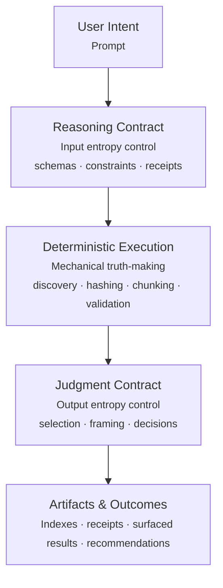

# Execution Flow

## Model

The execution flow represents the complete lifecycle of an ASI-style skill, from user input to final output, with clear boundaries between deterministic and discretionary operations.
